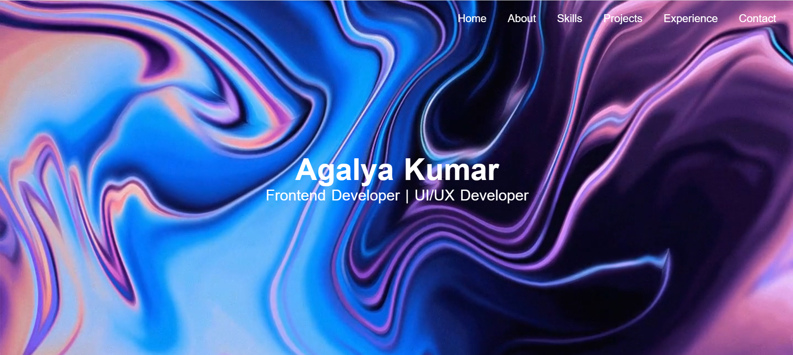

# Agalya Kumar – Frontend Developer Portfolio

Welcome to my portfolio! 👋  
I’m a Frontend Developer passionate about building **dynamic, responsive, and user-friendly web applications** using **React.js, Angular, JavaScript (ES6+), and TypeScript**.

🌐 **Live Portfolio:** [https://agalya0208.github.io/](https://agalya0208.github.io/)  
💻 **GitHub:** [https://github.com/Agalya0208](https://github.com/Agalya0208)  
🔗 **LinkedIn:** [https://linkedin.com/in/agalyakumar](https://linkedin.com/in/agalyakumar/)

---

## **About This Portfolio**
This portfolio showcases my **projects, UI/UX skills, and frontend expertise**. Key highlights:
- Built with **React.js** for fast, dynamic UI updates.
- Fully **responsive** and **mobile-friendly**.
- Demonstrates **reusable components** and **interactive design**.
- Optimized for **performance and accessibility**.

---

## **Projects Featured**
### 1. Portfolio Website
- **Description:** My personal portfolio website, built to showcase my projects, skills, and experience.  
- **Tech Stack:** React.js, CSS3, JavaScript (ES6+), GitHub Pages  
- **Live Demo:** [View Here](https://agalya0208.github.io/)  
- **Screenshots:**  
    
  

*(Repeat for other projects if you have any like a React app, EdTech app, or Angular project.)*

---

## **Skills Highlight**
- **Frontend:** React.js, Angular, HTML5, CSS3, JavaScript (ES6+), TypeScript, Bootstrap  
- **State Management:** Redux, Context API  
- **Tools:** Git, Webpack, VS Code, Chrome DevTools  
- **UI/UX:** Responsive Design, Accessibility, Performance Optimization  

---

## **How to Run Locally**
```bash
# Clone this repository
git clone https://github.com/Agalya0208/portfolio.git

# Navigate to project folder
cd portfolio

# Install dependencies
npm install

# Start the development server
npm start

Contact Me
📧 agalyakumar532@gmail.com
📞 +91 9789486727
🌐 Live Demo: [https://agalya0208.github.io/](https://agalya0208.github.io/)

